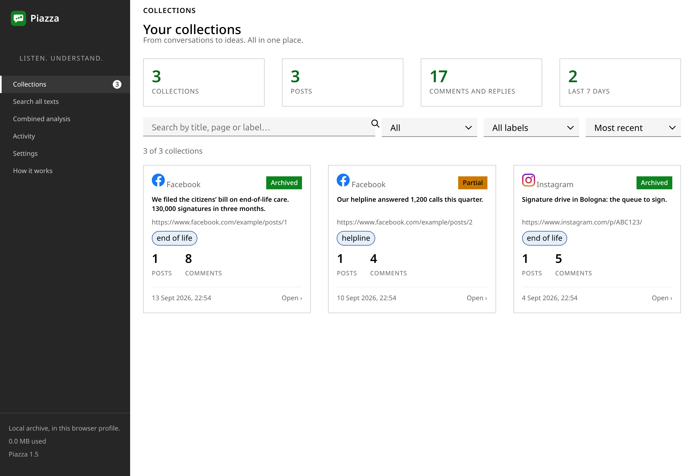
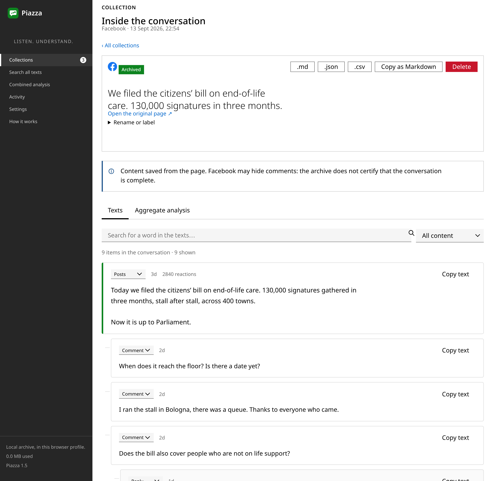
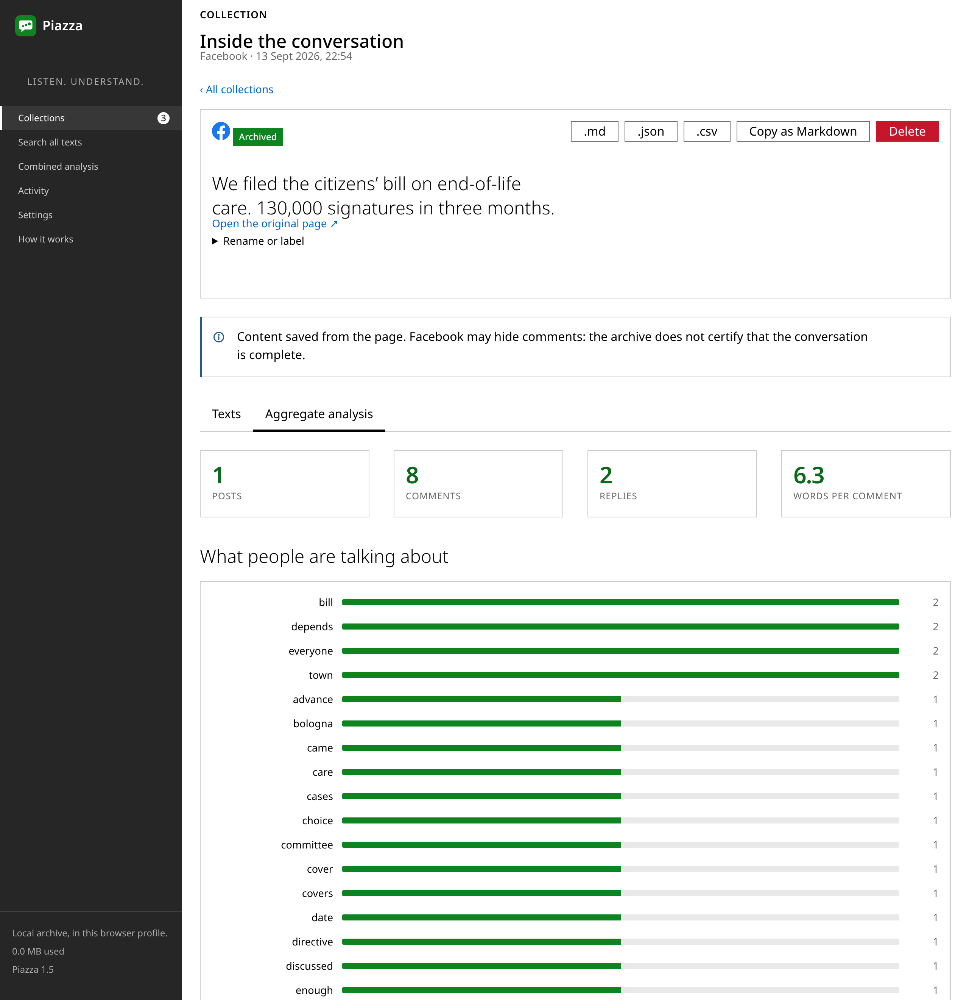
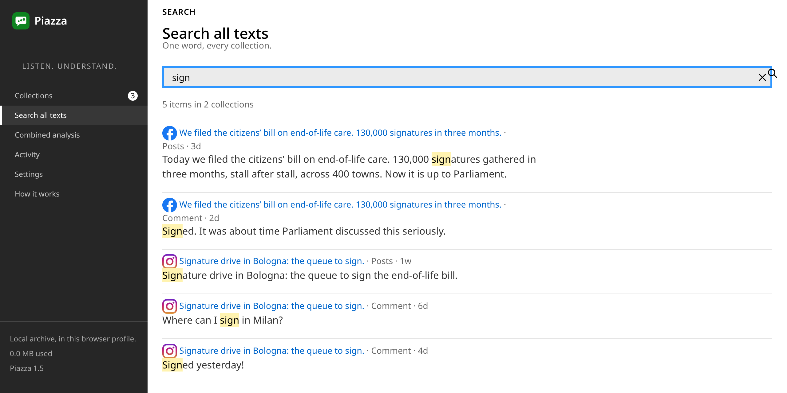
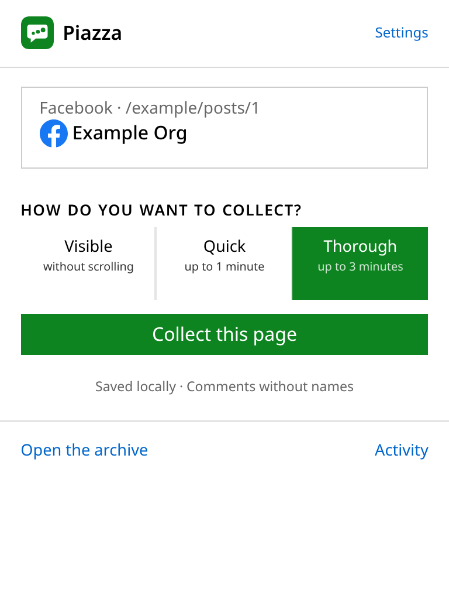

<div align="center">


# Piazza

**Collect and read Facebook and Instagram comments — in your own browser.**

A Chrome extension that gathers the posts and comments on the page you are
looking at, keeps them **on your machine**, and turns them into something you
can actually read: recurring themes, the questions people keep asking, the posts
that started the argument.

[](LICENSE)
[](manifest.json)
[](#install)
[](#privacy)
[](#language)

English · [Italiano](LEGGIMI.md)



</div>

---

## What it is

If you run the social media of a campaign, a charity or an association, the
comments under your posts are the most honest feedback you will ever get — and
the least readable. There are hundreds of them, half are hidden behind *"View
more comments"*, and the ones that matter are buried.

Piazza reads that conversation for you and gives it back as a whole: what people
talk about, **which questions come up again and again** — the objections you
should be answering — and which posts actually generated discussion.

It runs entirely in your browser. There is no account, no server, no cloud, and
nothing is ever sent anywhere.

## Why it is different

Most comment scrapers are headless robots that log in as you and hammer the
site. Piazza is deliberately not that.

| | |
|---|---|
| **It never logs in for you** | it uses the session you already have open. It never asks for, sees or stores your credentials |
| **It never bypasses anything** | CAPTCHAs and security checkpoints are detected, and it *stops* and tells you |
| **No stealth, no proxies** | no fingerprint spoofing, no proxy rotation, no account rotation. It is your ordinary browser |
| **It doesn't crawl** | it reads the single page you opened. It does not follow links, visit profiles or map networks of people |
| **No permanent site access** | it asks for `activeTab`: it can only see the tab where you pressed the button |
| **Comments are stored without authors** | no names, no profile URLs, not even pseudonyms |

If you need any of the things in the left column, this is the wrong tool.

## Features

- **Facebook and Instagram**, including **Reels**, where the comment panel is
  closed until you open it
- **Gets the comments that are actually hidden** — see [how](#how-it-finds-every-comment)
- **Threaded reading**: posts, comments and nested replies, in the right shape
- **Aggregate analysis**: recurring terms and phrases, questions asked in the
  comments, most-discussed posts, hashtags and links
- **Search across every collection** you have ever saved, with context
- **Combined analysis**: read several collections together — all of them, the
  last 30 days, only Facebook, only Instagram, or a selection
- **Labels** to group collections by campaign
- **Export** to Markdown, JSON and CSV — the Markdown is built to be pasted
  straight into a language model
- **Full backup and restore** of the archive as a single `.json`
- **Three collection modes**: visible only, quick (1 min), thorough (3 min)
- **Interface in English and Italian**, following your browser

## Screenshots

| Threaded conversation | Aggregate analysis |
|---|---|
|  |  |

| Search across collections | The popup |
|---|---|
|  |  |

## Install

Piazza is not on the Chrome Web Store. It loads as an unpacked extension, which
takes about thirty seconds:

```bash
git clone https://github.com/Mic-Fundraiser/piazza.git
```

1. open `chrome://extensions`
2. turn on **Developer mode**, top right
3. click **Load unpacked** and pick the cloned folder

That's it — there is **no build step**, no `npm install`, no bundler. The
extension runs the source as it is.

Then open a Facebook or Instagram post, click the Piazza icon and choose
**Collect this page**.

## How it finds every comment

This is the part most tools get wrong, and it is worth explaining.

**Facebook sorts comments by "Most relevant" by default, and that mode literally
hides some of them.** No amount of scrolling will make them appear. Piazza first
switches the thread to **"All comments"** — that single step is what unlocks the
rest. It recognises the sort control by its label in several languages and also
by its `aria-label`, for when the label is replaced by an icon.

After that it repeatedly opens *"View more comments"*, expands nested replies,
and clicks the **"See more"** that truncates long comments — which, inside
comments, is often not a `[role="button"]` at all but a plain `<span>` preceded
by an ellipsis, so looking only at buttons never finds it.

Between each click it **waits for new content to actually arrive** rather than
sleeping for a fixed time, which is what made it give up early on slow
connections.

It keeps going until the page stops growing, or until the time limit. **It does
not promise completeness**: the archive never claims a conversation is complete,
and every collection records whether it stopped because the page was exhausted
or because time ran out.

### While it runs

A small panel appears at the bottom right **of the page itself**, showing what
it is doing and how many items it has found, with **Pause** and **Stop and
save**. You can close the popup, switch tabs or minimise the window — the work
carries on in the tab.

## Privacy

**Comments are archived without their author.** No names, no profile URLs, not
even a pseudonym. The setting about names applies to *posts* only.

Everything lives in `chrome.storage.local`, inside this browser profile.
Nothing is transmitted: there is no analytics, no telemetry, no remote endpoint.

**Uninstalling the extension deletes the archive.** Settings include *Export the
whole archive*, and the file can be imported back whenever you like — on another
machine too.

Comments are personal data even when they are public. The point of this tool is
to read the *whole* — the themes, the recurring questions — not to profile
individuals: please do not turn political comments into contact lists.

### Permissions, one by one

| permission | what it is for |
|---|---|
| `activeTab` | read the page **only** in the tab where you clicked the button |
| `scripting` | inject the script that opens comments and reads the text, there |
| `storage`, `unlimitedStorage` | the archive in the browser; without the second one Chrome caps it at 10 MB |
| `127.0.0.1`, `localhost` | **only** for an optional feature, off by default: sending a copy to a Flask app running on your own computer. Off, nothing is contacted |

There is **no permission on `facebook.com` or `instagram.com`**. Without your
click on the icon, the extension sees nothing at all.

## FAQ

**Does this work without an account?**
No. It reads what your own logged-in browser can already see. It does not create
sessions or access anything you couldn't open yourself.

**Does it get *all* the comments?**
It gets far more than scrolling does, because it switches away from "Most
relevant" and keeps expanding. But no tool can guarantee completeness — Meta
decides what to render. Piazza tells you when it stopped early.

**Where does my data go?**
Nowhere. It stays in your browser profile. Export it if you want a copy.

**Can I use the exports with ChatGPT or Claude?**
That is what the Markdown export is for: it bundles the analysis and the cleaned
text, without the interface noise.

**Does it work on Reels?**
Yes, on both Facebook and Instagram. In Reels the comment panel is closed until
you press the icon, and Piazza opens it by itself.

**Is it on the Chrome Web Store?**
No. Load it unpacked, as above.

**Something stopped working — now what?**
Facebook and Instagram change their markup without notice. Open **Activity** in
the archive: it keeps a step-by-step trace of the last collection and tells you
where it stopped.

## Meta's Terms

Facebook's and Instagram's Terms prohibit automated collection of data without
written permission. This is a contractual matter between you and Meta, not a
criminal one, but the concrete risk — restriction or suspension of the account
you are signed in with — is real and falls on you. Weigh it up first, especially
if that account administers pages you depend on.

## Structure

```
manifest.json        Manifest V3
popup.html/.js       the panel: modes and start
raccogli.js          opens comments, replies and truncated text; the on-page panel
estrattore.js        reads the DOM (generated: Facebook and Instagram need two strategies)
sfondo.js            service worker: archives, keeps the diagnostic trace
archivio.html/.js    archive, analysis, search, settings
libreria/            storage, privacy, tree, analysis, export, language
vendor/              Vanilla Framework (LGPL v3, see LEGGIMI.md there)
```

The fragile piece is `estrattore.js`: selectors change without warning. It is
written so that a field that breaks costs you that field, not the whole
collection.

Source comments are in Italian, the language the project was written in.

## Language

The interface follows your browser and can be pinned in Settings. Dates, numbers
and alphabetical sorting follow the chosen language.

## Contributing

Issues and pull requests are welcome — especially selector fixes when Facebook
or Instagram change their markup. If you open an issue about a broken
collection, paste the trace from **Activity**: it says exactly where things
stopped.

## License

MIT — see [LICENSE](LICENSE).

The stylesheet in `vendor/` is Canonical's
[Vanilla Framework](https://vanillaframework.io), under LGPL v3, included
unmodified: see [vendor/LEGGIMI.md](vendor/LEGGIMI.md).

Piazza is not affiliated with or endorsed by Meta Platforms. "Facebook" and
"Instagram" are trademarks of their respective owners, named here only to
identify the sites this tool reads.
